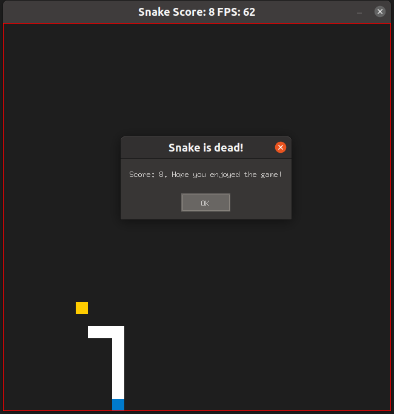
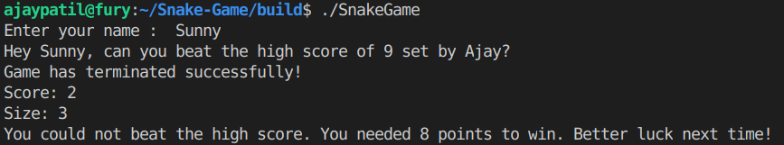

# C++ Nano-degree Capstone : Snake Game 

 I added features to 2D snake game for the Capstone project in the [Udacity C++ Nanodegree Program](https://www.udacity.com/course/c-plus-plus-nanodegree--nd213). The starter code for this repo was inspired by [this](https://codereview.stackexchange.com/questions/212296/snake-game-in-c-with-sdl) excellent StackOverflow post and set of responses.

The Capstone Project gave me a chance to integrate what I've learned throughout this program. 

In this project, I extended the Snake game by adding lots of new features, demonstrating that I can independently create applications using a wide range of C++ libraries & features.

## Feature additions

* **Score Logs**

  Added ability to store `highest score` and `highest scorer` name with newly defined `ScoreLog()` class. The file structure used is .txt & is managed with `fstream` objects in the new class.  

* **New console outputs**

  - Program takes user name and presents the current high score to beat. Once game is terminated, console prints points needed to set high score if lost & congratulates upon setting high score. 

    

* **Game play with boundary wall**

  - Added ability to play with a boundary wall. Snake dies if it touches the boundary wall! Pressing `b` key toggles the boundary during game play. The screenshot of the game above depicts the red wall that was being turned on during game play. 

*  **Pause Game**

  - Added ability to pause the game play. `Esc` key toggles between pause/resume. 

* **SDL window to display score**

  - Added a small SDL dialog that shows score upon termination of game. The window can seen the game screenshot above. 

## Dependencies for Running Locally
* cmake >= 3.7
  * All OSes: [click here for installation instructions](https://cmake.org/install/)
* make >= 4.1 (Linux, Mac), 3.81 (Windows)
  * Linux: make is installed by default on most Linux distros
  * Mac: [install Xcode command line tools to get make](https://developer.apple.com/xcode/features/)
  * Windows: [Click here for installation instructions](http://gnuwin32.sourceforge.net/packages/make.htm)
* SDL2 >= 2.0
  * All installation instructions can be found [here](https://wiki.libsdl.org/Installation)
  * Note that for Linux, an `apt` or `apt-get` installation is preferred to building from source.
* gcc/g++ >= 5.4
  * Linux: gcc / g++ is installed by default on most Linux distros
  * Mac: same deal as make - [install Xcode command line tools](https://developer.apple.com/xcode/features/)
  * Windows: recommend using [MinGW](http://www.mingw.org/)

## Basic Build Instructions

1. Clone this repo.
2. Make a build directory in the top level directory: `mkdir build && cd build`
3. Compile: `cmake .. && make`
4. Run it: `./SnakeGame`.

## Capstone rubric criteria 

**1. README, Compiling and Testing rubrics are met. **

**2. Loops, Functions, I/0**

(a) *The project demonstrates an understanding of C++ functions and control structures.*

A variety of control structures are used in this project. The `RenderScoreMsg()` function declared in `snake.h` file line 30,  is used to display a SDL Msg window only if `alive` variable of snake is `false`. This function is used in `snake.cpp` on lines 71 & 45. Also, in `main()`, the console output to display depends on if user was able to beat the high score or not. If-else control structure is used to compare scores and display appropriate message. Lines 37-45 in main. Lastly, on line 75 in `renderer.cpp`, the red box around the game is rendered only if the bool `_boundary` is true. 

(b) *The project reads data from a file and process the data, or the program writes data to a file.*

The project reads and writes high scores to a external text file `highscore.txt`. This is implemented in `ParseLog()` and `WriteToLog()` methods of the `ScoreLog`  class. The code can be found in `ScoreLog.cpp` on lines 21-51. 

(c) *The project accepts user input and processes the input.*

The program accepts user inputs which include `player name` on line 23 in `main.cpp`, new SDLK poll events, i.e. `ESC` key input to toggle pause/resume and `b` key press to toggle boundary. This code is in `controller.cpp` on lines 41-48.

**2.  Object Oriented Programming**

The code in `scorelog.h` and `scorelog.cpp` satisfies multiple Object Oriented Programming criteria.

(a) *The project uses Object Oriented Programming techniques.*

The project code is organized into classes with class attributes to hold the data, and class methods to perform tasks. Check `scorelog.h` for declarations of attributes and class methods. 

(b) *Classes use appropriate access specifiers for class members.*

All class data members are explicitly specified as public, protected, or private. Check `scorelog.h` to see access specifiers. Getters/Setters have appropriate specifiers and so do the private attributes. 

(c) *Class constructors utilize member initialization lists.*

A constructor for class `ScoreLog()` that takes an `int` and `std::string`  is defined in the  `ScoreLog.cpp` on line 11 and is used in `main.cpp` to create a ScoreLog object on line 17.

(d) *Classes abstract implementation details from their interfaces.*

Methods `ParseLog()` and `WriteToLog()` within `ScoreLog.cpp` abstract all the external file handling from the user. User does not have to worry about manipulating the .txt file at all. 

**3. Memory Management**

(a) *The project makes use of references in function declarations.*

The project makes use of pointers in lots of newly defined functions of `ScoreLog` class. 

(b) *The project uses destructors appropriately.*

The project makes use of destructor for `ScoreLog()` class.